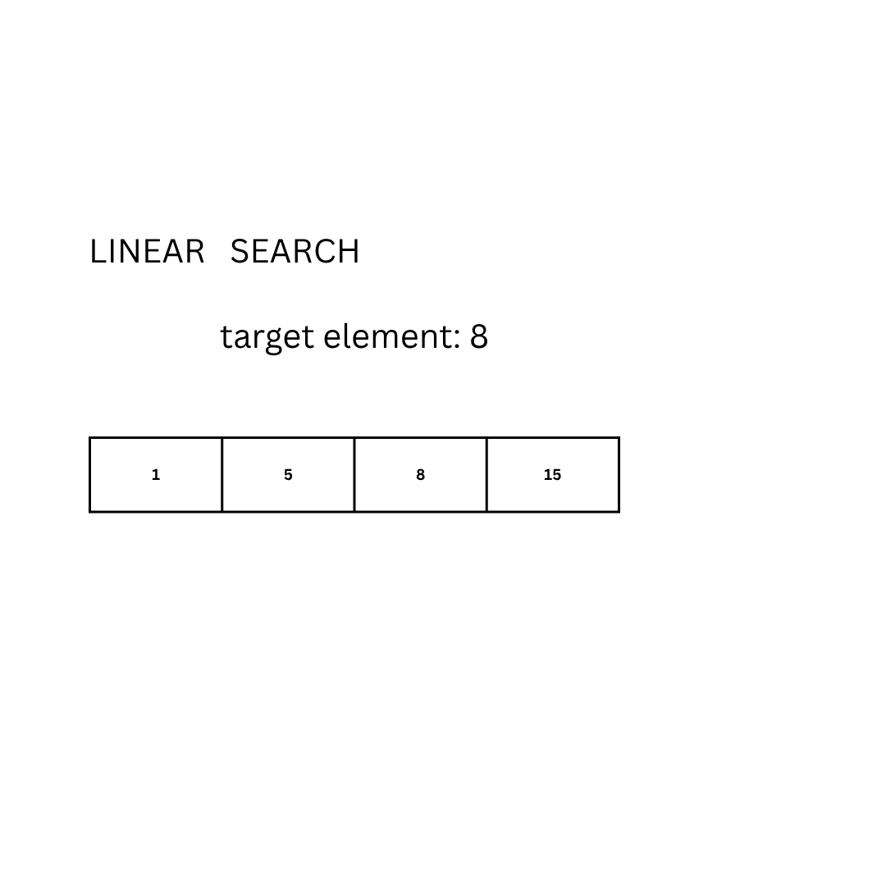
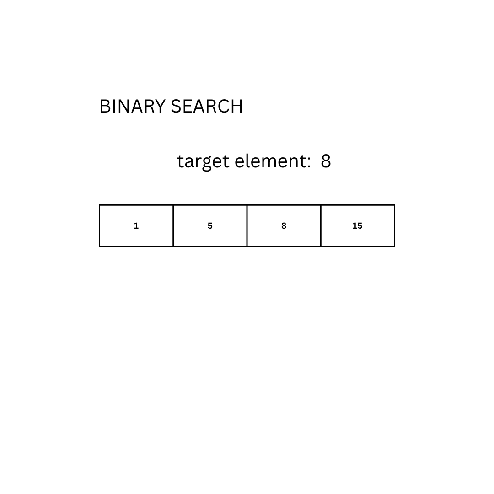

# The importance of writing your own exploit: <br />Binary search and SQLi

# ! [writing in progres]

## Introduction

Like many I started my journey in web application hacking through CTFs (and I seriously raccomend them, it’s a valuable and funny way to learn!) but after googling some details of some CTFs that I was unable to solve, as happens when you don’t know something, I happened to read some write-ups of the solution.
In most of the cases you will find a brief explanation of the vulnerability and a very specif one of the exploitation process used to get the flag.
Also in most of the cases in those writeups you are going to use some pre-build tools that do almost all of the work for you, giving you the flag or a prebuild exploit.
Using them is like watching a magician taking a rabbit from his hat, but I think that the really cool part of hacking is the curiosity, is the willing of understanding the magic behind that trick.
With this article, and generally with this blog, I want to try to go deeper in the white rabbit hole.
Today we are going to see two important concepts of computer science and cybersecurity: time complexity and SQL injections.

## What is time complexity? - a brief introduction

We can say that **time complexity** is *"a way to measure the efficiency of an algorithm over the time"*.
What does that mean? Let's take as example a classical search problem to explain the concept:
> Given an ordered set of data D and an element E find it's position, if that element is not in the given set answer with "-1".
>
> Examples:
>
> - given the set D = {1,5,8,15} and the element E = 8 the aspected output is 3 (or 2 if the set is 0-indexed)
> - given the set D = {"a", "d", "l", "z"} and the element E = "b" the aspected output is -1 since it's not an elment in the set.

The most basic approach to solve the problem can be done by looking for each element of the set:

```

int search(D, E):
    for (int i = 1; i < length(D); i++):
        if(D[i] == E):
            return i
    return -1
```



<br/>

Another approach is the so called binary search.
The idea is to repeatedly divide the search interval in half:

1. Start with the middle element of the array D.
2. If it matches the target E, return the index.
3. If E is smaller, repeat the search on the left half.
4. If E is larger, repeat on the right half.
5. If the range becomes empty, the element is not found

```
int binarySearch(D, E):
    low = 0
    high = length(D) - 1

    while low <= high:
        mid = (low + high) // 2

        if D[mid] == E:
            return mid
        else if D[mid] < E:
            low = mid + 1
        else:
            high = mid - 1

    return -1
```



<br/>

Now: we have two diffente algorithms to solve the same same problem, which one should we choose?
Generally speaking the answer to this question depends on the choise criteria, in this case we want the most efficient one, or in other words, the algorithm that gives as the correct output as soon as possible.

I'm stuck as a turing machine in the halting problem.

## What is a SQLi? Types and detection

## Blind SQLi: two approaches burpsuite vs scripting

We are going to use for this part [this lab](https://portswigger.net/web-security/sql-injection/blind/lab-conditional-responses).

### Burpsuite usage

The first and most common approach to this challenge we can take is using the

### Scripting a solution

## Bonus tip: parallel code runs faster
